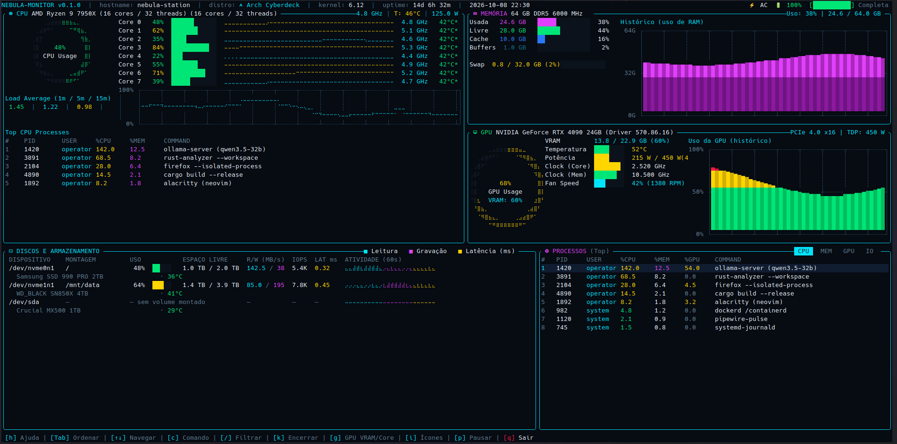

# NEBULA-MONITOR

Monitor de sistema para terminal em Rust, inspirado em btop, nvtop, htop e iotop, com visual neon. Para Linux: CPU, GPU NVIDIA, memória, discos, rede e processos em painéis que você reorganiza ou troca, inclusive por painéis próprios.



## 🚀 Funcionalidades

* **⚡ CPU (AMD Ryzen / Intel):**
  * Medidor circular contínuo em matriz de sub-pixels Braille (2x4).
  * Uso detalhado por núcleo (Core) com barras de 12 blocos e sparklines fluidas em Braille (`⡀⢄⡠⢄`).
  * Frequência em GHz lida em tempo real via sysfs e temperatura (°C).
  * Temperatura por núcleo via `coretemp` (Intel). Em AMD, quando o Linux informa a associação entre CPU lógica e CCD, a coluna mostra a temperatura compartilhada do CCD com `*`. Sem essa associação ou sem sensor, a coluna mostra `—`.
  * Consumo em Watts medido pelos contadores RAPL (`/sys/class/powercap`). Desde o kernel 5.10 a leitura exige root; sem permissão o valor é omitido. Para liberar sem rodar como root: `sudo chmod o+r /sys/class/powercap/intel-rapl:*/energy_uj` (vale até o próximo boot).
  * Gráfico de histórico de carga e tabela dos processos com maior consumo de CPU.
* **💾 Memória & Swap:**
  * Uso detalhado: Usada, Livre, Cache, Buffers e Swap.
  * Gráfico de histórico de RAM estilizado em estilo osciloscópio preenchido em magenta.
* **🎮 GPU (NVIDIA via NVML nativo):**
  * Medidor circular configurável com **Modo VRAM** (memória de vídeo alocada) e **Modo Core** (cálculo ativo dos núcleos CUDA/Tensor).
  * Informações completas de VRAM, temperatura (°C), consumo de energia (Watts / TDP).
  * Clocks de Core e Memória, velocidade da ventoinha (RPM / %).
  * Gráfico de histórico em tempo real com gradiente dinâmico.
* **📁 Discos e Armazenamento (Layout 2-Tier):**
  * Visualização em duas camadas: linha lógica (montagem, espaço livre/total, IOPS, latência) e linha física (modelo de hardware do fabricante e sensor térmico).
  * Alinhamento vertical estrito da coluna de temperatura.
  * Taxas de I/O em tempo real (Leitura e Gravação em MB/s via `/proc/diskstats`).
  * Sparkline multi-colorida de atividade recente (Ciano = Leitura, Magenta = Gravação, Amarelo = Latência).
* **⚙️ Tabela de Processos:**
  * Ordenação dinâmica com abas: `[CPU]`, `[MEM]`, `[GPU]`, `[IO]`.
  * **Exibição do uso de GPU (%GPU)** para processos CUDA/Gráficos em execução (ex: LLMs locais).
* **🌐 Rede** (painel opcional, via [layout configurável](#-layout-configurável)):
  * Recebimento e envio por interface: taxa atual, total e atividade recente (↓ ciano, ↑ magenta).
  * Ignora o loopback e interfaces sem tráfego; sem nenhuma ativa, cede a vaga ao próximo painel da lista.

## ⌨️ Controles e Atalhos

| Tecla | Função |
| :--- | :--- |
| `q` ou `Esc` | Sair e restaurar o terminal (antes de sair, o `Esc` fecha a ajuda, restaura o painel maximizado, tira o foco e limpa o filtro, nessa ordem) |
| `1` a `9` | Focar a vaga correspondente do layout (moldura amarela); as teclas vão primeiro para ela |
| `z` | Maximizar / restaurar o painel focado (`Esc` também restaura) |
| `g` | **Alternar medidor da GPU** entre **VRAM Usage** (alocação) e **Core Util** (computação ativa) |
| `Tab` | Alternar ordenação dos processos (`[CPU]` → `[MEM]` → `[GPU]` → `[IO]`) |
| `i` | Alternar entre ícones **Nerd Fonts** e conjunto **Universal Unicode** (anti-tofu) |
| `↑` / `↓` | Rolar e selecionar processos |
| `c` | Coluna COMMAND: nome do processo ou linha de comando completa |
| `/` | Filtrar processos por nome, linha de comando ou PID (`Enter` aplica, `Esc` limpa) |
| `k` | Encerrar o processo selecionado com SIGTERM, depois de confirmar com `s` |
| Mouse | Clique foca o painel, seleciona um processo ou troca a aba de ordenação; a roda rola a lista |
| `p` | Pausar / retomar a atualização |
| `h` | Abrir / fechar a ajuda (com a ajuda aberta, `Esc` só fecha o popup) |

## 🧩 Layout configurável

Cada vaga da tela recebe uma lista de painéis em ordem de preferência: o primeiro
disponível ocupa a vaga. Sem arquivo de configuração, a tela é a de sempre.

O arquivo fica em `~/.config/nebula/config.toml` (ou `$XDG_CONFIG_HOME/nebula/config.toml`),
ou em qualquer caminho via `--config <arquivo>`.

```toml
refresh_ms = 1000         # intervalo entre coletas, em ms (200 a 60000; padrão 1000)

[theme]                   # opcional: cores (veja "Tema" abaixo)
primary_accent = "#ffb000"

[layout]
split = "rows"            # "rows" empilha, "cols" põe lado a lado
sizes = [55, 45]          # porcentagens de cada filho (somam 100)
children = [
  { split = "cols", sizes = [52, 48], children = [
      { panels = ["cpu"] },
      { panels = ["gpu", "memory"] },   # sem NVIDIA, a Memória assume a vaga
  ]},
  { split = "cols", sizes = [60, 40], children = [
      { panels = ["disks"] },
      { panels = ["processes"] },
  ]},
]
```

Painéis disponíveis: `cpu`, `memory`, `gpu` (`gpu2`, `gpu3` e `gpu4` para outras placas NVIDIA), `disks`, `processes` e `network`. Até 9 vagas
(teclas `1`–`9`). Uma configuração inválida (id desconhecido, `sizes` que não somam 100,
campo desconhecido...) interrompe a inicialização com uma mensagem apontando onde está o erro.

Pronto para usar: [`examples/configs/network-fallback.toml`](examples/configs/network-fallback.toml)
mantém a tela de sempre, mas mostra a Rede quando não há GPU NVIDIA
(`nebula-monitor --config examples/configs/network-fallback.toml`).

### 🎨 Tema

A seção `[theme]` troca as cores da paleta neon em toda a tela, no formato `"#rrggbb"`.
As chaves ausentes ficam com a cor padrão.

```toml
[theme]
background = "#100b05"
primary_accent = "#ffb000"
```

| Chave | Padrão | Onde aparece |
| :--- | :--- | :--- |
| `background` | `#070b12` | Fundo |
| `text_primary` | `#ebf3fa` | Texto principal |
| `text_secondary` | `#5f7d91` | Rótulos e texto secundário |
| `panel_border` | `#00d2f0` | Molduras dos painéis |
| `bar_track` | `#1c2836` | Parte vazia das barras |
| `primary_accent` | `#00e5ff` | Destaque principal, leitura, recebimento |
| `separator` | `#146e8c` | Separadores, buffers na memória |
| `status_good` | `#00e676` | Uso baixo, valores bons |
| `status_warning` | `#ffd600` | Uso médio, moldura do painel focado |
| `status_critical` | `#ff1744` | Uso alto, alertas |
| `secondary_accent` | `#e040fb` | Memória, gravação, envio |
| `cache_usage` | `#2979ff` | Cache na memória |


Os tons derivados (degradês dos gráficos e linhas de grade) continuam os da paleta neon.
Exemplo completo: [`examples/configs/amber-theme.toml`](examples/configs/amber-theme.toml).

## 🔌 Criando um painel

Um painel é qualquer tipo que implementa o trait `Panel` do crate `nebula-core` (o SDK).
Ele coleta os próprios dados, se desenha e trata as próprias teclas — exatamente como os
painéis nativos, que usam a mesma API.

| Método | Para quê |
| :--- | :--- |
| `id()` | Nome usado na configuração (`panels = ["meu"]`) |
| `update(ctx)` | Coleta, a cada `refresh_ms` (1 s por padrão). `ctx.system` (sysinfo) e `ctx.nvml` já vêm atualizados |
| `render(area, buf, view)` | Desenha na área da vaga |
| `available()` | `false` quando não há o que mostrar: a vaga passa para o próximo painel da lista |
| `handle_key(key)` / `keybindings()` | Teclas próprias e os atalhos que aparecem no rodapé e na ajuda |
| `captures_input()` | `true` enquanto o painel recebe texto ou espera uma confirmação: todas as teclas vão para ele |
| `handle_mouse(event, area)` | Cliques e rolagem dentro da vaga (o clique já focou a vaga) |
| `min_size()` | Tamanho mínimo útil |

Para usar, monte um binário pessoal que acrescenta o painel aos nativos:

```rust
use nebula_monitor::registry::{self, PanelFactory};

fn main() -> Result<(), Box<dyn std::error::Error>> {
    let mut paineis = registry::builtin();
    paineis.push(PanelFactory {
        id: "meu",
        create: || Box::new(MeuPainel::new()),   // coleta real
        demo: || Box::new(MeuPainel::demo()),    // dados fictícios do --demo
    });
    nebula_monitor::run(paineis)
}
```

O exemplo completo, com testes, está em [`examples/hello-panel`](examples/hello-panel/src/main.rs)
(o CI o compila e testa a cada push). Boas práticas:

* `update` roda no mesmo laço da tela: mantenha-o rápido. Trabalho lento (rede, disco,
  comandos externos) vai para um `nebula_core::Worker`, que roda numa thread própria no
  ritmo escolhido; o `update` só pega o último resultado com `take_latest()`:

  ```rust
  let contagem = Worker::spawn("email", Duration::from_secs(60), || consultar_servidor());
  // em update():
  if let Some(n) = self.contagem.take_latest() { self.nao_lidas = Some(n); }
  ```

  O `hello-panel` usa um `Worker` assim, com uma consulta lenta simulada.
* `q`, `Ctrl+C`, `h`, `i`, `p`, `z` e `1`–`9` são do monitor e não chegam aos painéis
  (exceto durante `captures_input()`, quando só o `Ctrl+C` continua global). O `Esc` chega
  ao painel quando não há ajuda, maximizado nem foco para desfazer; se o painel o tratar,
  o monitor não encerra.
* Use `nebula_core::theme` e `nebula_core::widgets` para ter a mesma cara dos nativos. As
  cores de `nebula_core::theme` também seguem o `[theme]` da configuração.
* Se o painel entrar em pânico, ele é retirado da vaga e o resto do monitor continua. Num
  `Worker`, o pânico para só a thread dele e fica disponível em `failure()`.

## 🛠️ Instalação e Execução

### Compilar e Instalar

```bash
git clone https://github.com/cadocruz/nebula-monitor.git
cd nebula-monitor
cargo install --path nebula-monitor --root ~/.local
```

### Executar

```bash
nebula-monitor
```

### 📸 Modo Demonstração (Screenshots Limpos)

Para tirar capturas de tela sem expor o hostname real da sua máquina, caminhos privados ou processos locais:

```bash
# Executa interativamente com dados fictícios elegantes
nebula-monitor --demo

# Ou exporta o texto renderizado diretamente no terminal
nebula-monitor --demo --dump 160 40
```

## 🧪 Desenvolvimento

```bash
cargo test                       # testes unitários + referências de tela
cargo fmt && cargo clippy --all-targets -- -D warnings   # o CI exige os dois
```

As **referências de tela** (`nebula-monitor/tests/golden/`) guardam o modo demo renderizado em vários
tamanhos de terminal: os caracteres (`.txt`) e as cores e estilos (`.styles`). Qualquer
mudança visual faz o teste falhar apontando linha e coluna. Se a mudança for intencional,
regere e revise o diff antes de commitar:

```bash
UPDATE_GOLDEN=1 cargo test golden
git diff nebula-monitor/tests/golden/
```
